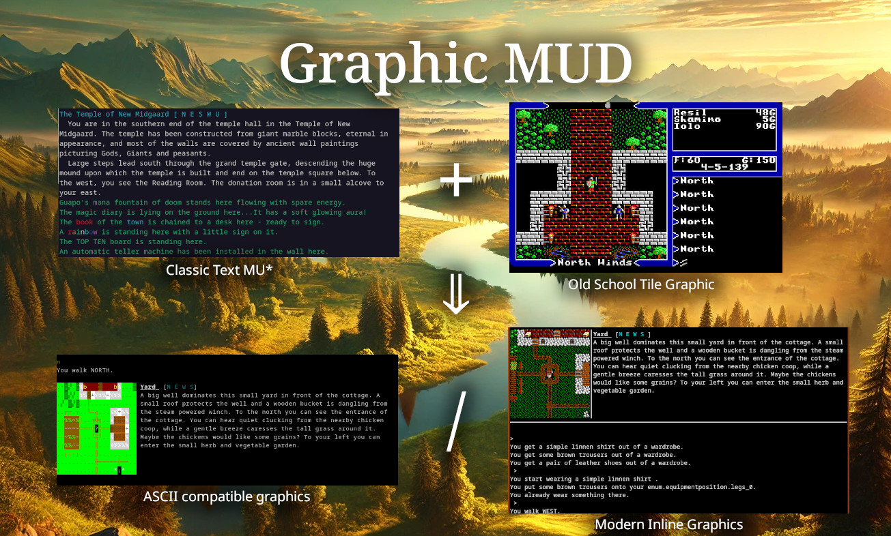

<!--SPDX-FileCopyrightText: 2024 Stefan Prelle <stefan at prelle dot org>
SPDX-License-Identifier: MPL-2.0-->
# Graphic MUD
### A Java MUD engine

The majority of MU\*s out there have on thing in common: They are based on 
the concept of a **Room** - a place in the virtual space that has a description
and exits into directions that lead to other rooms. On some servers such rooms 
are accompanied with small static ASCII maps, but that is not a general rule.

Games with **tile graphics** build their visuals with elements of a fixed size, 
usually a square of 16x16 or 32x32 pixel. That kind of visualization is often 
used for JRPGs or Rogue-likes - or games like the early Ultima series.

The idea of this project is to provide an engine for a MU\* that integrates 
tile maps into a classic MU\*.

## Goals
* Build a classic MU\* engine that allows connecting with Telnet or any MUD client
* Allow specifying zones and link them to tilemaps.
* Deliver maps of the players surrounding as graphic, ANSI art or not at all - depending on detected client capabilities and user preference.
* Support of sound, music (via GMCP, MSP or MXP) and inline images (via Sixel, IIP, Kitty) 
* Clean separation between game engine and RPG rules
* Support auto-combat as well as turn-based combat
* Easy customization and localization